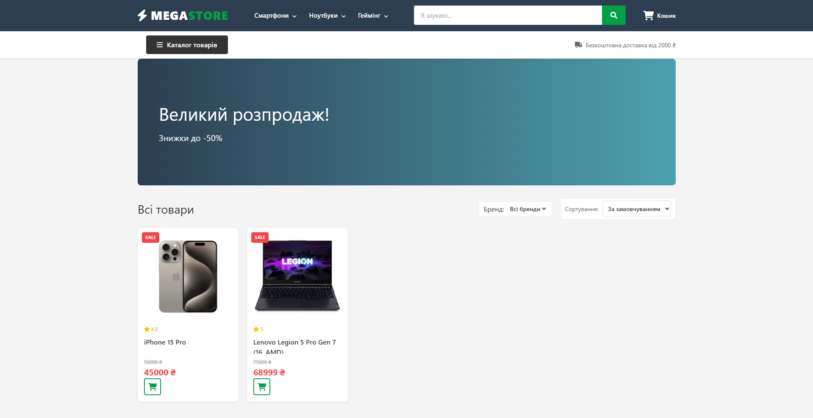

# 🛒 Custom React E-commerce Application

A high-performance, fully responsive online store built with **React.js**. This project demonstrates a custom e-commerce solution with dynamic product filtering, cart management, and a seamless checkout UI.

> **🔴 Live Demo:** [megastore-tech.pp.ua]

## 📸 Screenshots
 
*Main Catalog Interface*

## 🛠 Tech Stack
* **Core:** React.js (Hooks, Custom Hooks)
* **State Management:** Redux Toolkit / Context API
* **Styling:** SCSS (Sass) / CSS Modules (BEM methodology)
* **Routing:** React Router v6
* **Version Control:** Git

## ✨ Key Features
* **⚡ Blazing Fast Performance:** Optimized SPA architecture (Single Page Application).
* **🔍 Advanced Filtering:** Filter products by category, price range, and attributes.
* **📱 Mobile-First Design:** Fully responsive layout that works perfectly on all devices.
* **🛒 Dynamic Cart:** Real-time cart updates, item removal, and quantity adjustment.
* **🎨 Custom UI/UX:** Clean, modern interface designed from scratch (no heavy UI libraries).

## 🚀 How to run locally

1.  Clone the repository:
    ```bash
    git clone [https://github.com/your-username/your-repo-name.git](https://github.com/your-username/your-repo-name.git)
    ```
2.  Install dependencies:
    ```bash
    npm install
    ```
3.  Start the development server:
    ```bash
    npm start
    ```
